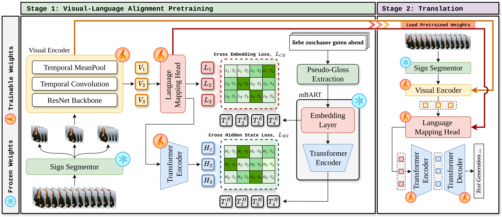
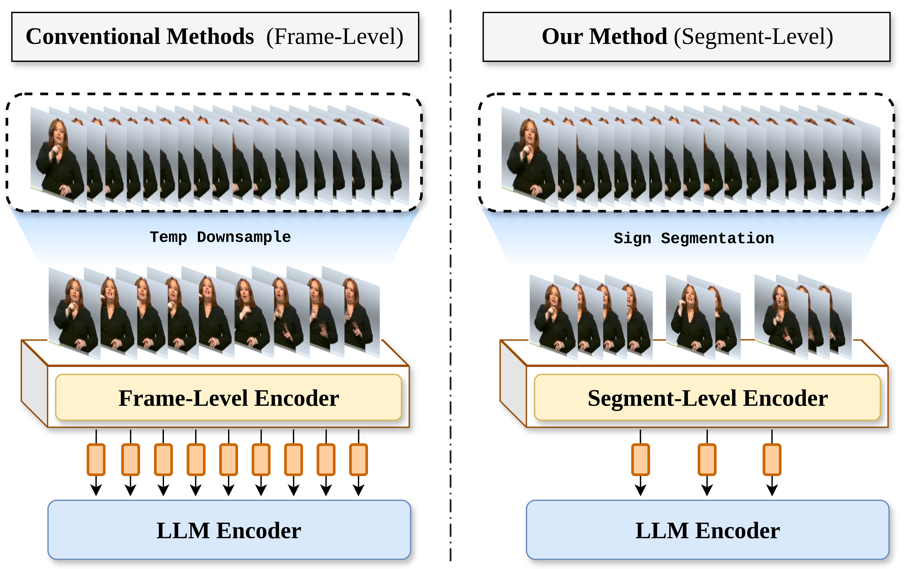
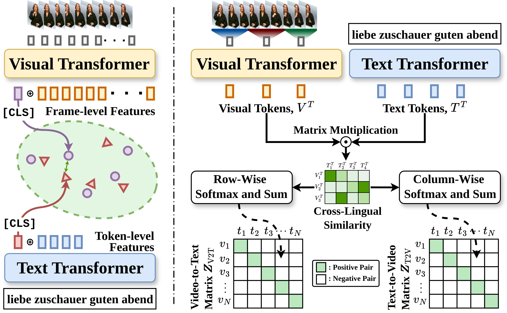

# SAGE: Segment-Aware Gloss-Free Sign Language Translation

<div align="center">
  <a href="https://openaccess.thecvf.com/content/ICCV2025W/MSLR/papers/Low_SAGE_Segment-Aware_Gloss-Free_Encoding_for_Token-Efficient_Sign_Language_Translation_ICCVW_2025_paper.pdf">
    
  </a>
  <a href="https://arxiv.org/abs/2507.09266">
    
  </a>
  
  <a href="LICENSE">
    
  </a>
</div>

<div align="center">
  
</div>

Official implementation of **SAGE: Segment-Aware Gloss-Free Encoding for Token-Efficient Sign Language Translation**. **Best Paper Award** at the ICCV Workshop on Multi-modal Sign Language Recognition and Translation (MSLRT) 2025.

---

## Overview

Sign language translation (SLT) is typically bottlenecked by the need for gloss-level annotations, which are expensive and scarce. SAGE eliminates this requirement through a two-stage, gloss-free framework built on sign segmentation.

**Key idea:** rather than treating the entire signing video as a flat sequence of frames, SAGE partitions the video into semantically meaningful sign segments. Each segment is encoded independently and pooled into a single compact token, dramatically reducing sequence length while preserving sign-level structure.

<div align="center">
  
</div>

*Figure 1. Segment-level encoding yields shorter, more expressive sequences compared to frame-level approaches, improving both efficiency and translation quality.*

### Stage 1 — Cross-Lingual Contrastive Learning (CLCL) Pretraining

The visual encoder is pretrained by aligning segment-level sign features with pseudo-gloss text embeddings extracted from MBart. The contrastive objective is based on [CLCL](https://arxiv.org/abs/2303.12793). Pseudo-glosses are automatically derived from translation sentences via POS tagging — no manual gloss annotation is required.

<div align="center">
  
</div>

*Figure 2. Cross-Lingual Contrastive Learning (CLCL) loss aligns visual segment features with pseudo-gloss text embeddings in a shared embedding space. See [Zeng et al. (2023)](https://arxiv.org/abs/2303.12793) for details.*

### Stage 2 — Translation Fine-tuning

The pretrained segment encoder is connected to a full MBart encoder-decoder and fine-tuned end-to-end for sign-to-spoken-language translation.

---

## Installation

### Prerequisites

- CUDA-capable GPU (tested on CUDA 12.8)
- [Conda](https://docs.conda.io/en/latest/) or Python 3.10

### Option A — Conda (recommended)

```bash
conda env create -f environment.yml
conda activate sage
```

### Option B — pip

```bash
pip install -r requirements.txt
```

Both options install PyTorch 2.10 + CUDA 12.8. For a different CUDA version, update the `--extra-index-url` line in `environment.yml` / `requirements.txt` (see [pytorch.org/get-started](https://pytorch.org/get-started/locally)).

### Option C — Docker

```bash
docker build -f docker/Dockerfile -t sage .
docker run --gpus all \
  -v /path/to/phoenix/frames:/data/phoenix \
  -v /path/to/support_files:/app/support_files \
  sage:latest
```

### spaCy language models (data preparation only)

```bash
python -m spacy download de_core_news_lg   # Phoenix-2014T (German)
python -m spacy download zh_core_web_sm    # CSL-Daily (Chinese)
```

> **Environment:** Python 3.10 · PyTorch 2.10 · CUDA 12.8

---

## Pretrained Models

SAGE reuses the MBart backbone from [GFSLT-VLP](https://github.com/zhoubenjia/GFSLT-VLP). Follow the instructions in their [pretrain_models/README.md](https://github.com/zhoubenjia/GFSLT-VLP/blob/main/pretrain_models/README.md) to obtain:

```
pretrain_models/
├── MBart_trimmed/          # Trimmed MBart encoder (Phoenix-2014T)
│   ├── config.json
│   ├── pytorch_model.bin
│   ├── sentencepiece.bpe.model
│   ├── special_tokens_map.json
│   └── tokenizer_config.json
└── mytran/                 # Visual encoder initialisation
    ├── config.json
    └── pytorch_model.bin
```

---

## Data Preparation

SAGE requires three precomputed support files per dataset. Run the steps below in order.

| Step | Output file | Config key |
|------|-------------|-----------|
| 1. Metadata | `support_files/metadata/*.pkl` | `data.metadata_path` |
| 2. Segment annotations | `support_files/*_segments.pkl` | `data.segment_path` |
| 3. Sentence embeddings | `support_files/*_sent_embeddings.pkl` | `data.sentence_embedding_path` |

### Step 1 — Generate metadata

Extracts pseudo-glosses via POS tagging and builds the video-to-translation mapping. Reads from the label files included in `data/` — no external download required.

```bash
# Phoenix-2014T
python scripts/prepare_metadata.py phx14t \
  --output support_files/metadata/phoenix14T_metadata.pkl

# CSL-Daily
python scripts/prepare_metadata.py csldaily \
  --output support_files/metadata/csldaily_metadata.pkl
```

### Step 2 — Download and process segment annotations

Download the precomputed segmentor outputs from Google Drive:

```bash
pip install gdown
gdown --folder https://drive.google.com/drive/folders/1KiXbHHtC7ugzzdPq_BGr4u5o43hP-ZLl \
      -O support_files/segment_annotations/
```

Then convert to the SAGE segment format:

```bash
# Phoenix-2014T
python scripts/prepare_segment_annotations.py phx14t \
  --segs support_files/segment_annotations/SAGE/phoenix14T_segmentor_outs.pt \
  --metadata support_files/metadata/phoenix14T_metadata.pkl \
  --output support_files/phoenix14T_segments.pkl

# CSL-Daily
python scripts/prepare_segment_annotations.py csldaily \
  --segs support_files/segment_annotations/SAGE/csldaily_segmentor_outs.pt \
  --metadata support_files/metadata/csldaily_metadata.pkl \
  --output support_files/csldaily_segments.pkl
```

### Step 3 — Extract sentence embeddings

Precomputes per-token MBart encoder embeddings for all translation sentences (used as text anchors in the CLCL loss).

```bash
# Phoenix-2014T
python scripts/prepare_sentence_embeddings.py phx14t \
  --metadata support_files/metadata/phoenix14T_metadata.pkl \
  --mbart_path pretrain_models/MBart_trimmed \
  --output support_files/phoenix14T_sent_embeddings.pkl

# CSL-Daily
python scripts/prepare_sentence_embeddings.py csldaily \
  --metadata support_files/metadata/csldaily_metadata.pkl \
  --mbart_path pretrain_models/MBart_trimmed_csldaily \
  --output support_files/csldaily_sent_embeddings.pkl
```

### Step 4 — Configure paths

The config files in `configs/` use relative paths for all precomputed files. The only value you must supply is `img_path` — the location of the raw video frames on your machine. Pass it on the command line:

```bash
python stage1_pretraining.py data.img_path=/path/to/phoenix-2014T/features/fullFrame-210x260px
```

---

## Training

Configuration is managed with [Hydra](https://hydra.cc). Stage-specific hyperparameters live in `configs/stage1.yaml` and `configs/stage2.yaml`, both of which inherit shared settings from `configs/sage.yaml`. Any value can be overridden from the command line.

### Stage 1 — CLCL Pretraining

```bash
python stage1_pretraining.py \
  data.img_path=/path/to/frames \
  output_dir=out/stage1
```

### Stage 2 — Translation Fine-tuning

```bash
python stage2_translation.py \
  data.img_path=/path/to/frames \
  finetune=out/stage1/best_checkpoint.pth \
  output_dir=out/stage2
```

### Evaluation only

```bash
python stage2_translation.py \
  data.img_path=/path/to/frames \
  resume=out/stage2/best_checkpoint.pth \
  eval=true
```

---

## Citation

If you find this work useful, please cite:

```bibtex
@inproceedings{low2025sage,
  title     = {SAGE: Segment-Aware Gloss-Free Encoding for Token-Efficient Sign Language Translation},
  author    = {Low, Jian He and Sincan, Ozge Mercanoglu and Bowden, Richard},
  booktitle = {Proceedings of the IEEE/CVF International Conference on Computer Vision Workshops (ICCVW)},
  year      = {2025}
}
```

---

## Acknowledgements

This codebase builds upon [GFSLT-VLP](https://arxiv.org/abs/2307.14768) (Zhou et al., ICCV 2023). The CLCL contrastive objective is adapted from [Zeng et al. (2023)](https://arxiv.org/abs/2303.12793). We thank the authors for open-sourcing their work.

## License

This project is licensed under the [MIT License](LICENSE).
